# Polly – E-Mail-Flows

Diese Datei dokumentiert **alle E-Mails**, die Polly verschickt: was sie auslöst, über welche Route bzw. welchen Service sie laufen, an wen sie gehen und – besonders wichtig – **welche Links und Anhänge** jede E-Mail enthält.

> Jedes Diagramm ist als **fertiges Bild** (PNG) eingebettet und damit überall direkt sichtbar – auch in der Replit-Vorschau und in einfachen Markdown-Viewern. Der zugehörige [Mermaid](https://mermaid.js.org/)-Quellcode bleibt darunter in einem einklappbaren Bereich („Mermaid-Quellcode anzeigen") erhalten und ist die bearbeitbare Quelle.
>
> **Bilder neu erzeugen** (nach Änderungen am Mermaid-Quellcode): `node scripts/render-mermaid.mjs` – das rendert alle Diagramme neu nach `docs/assets/email-flows/`.
>
> Alle API-Routen liegen unter dem Präfix `/api/v1` (es gibt zusätzlich Legacy-Aliase ohne Versionsnummer unter `/api`). In den Diagrammen sind die primären Routen angegeben.

## Legende der Knotenformen

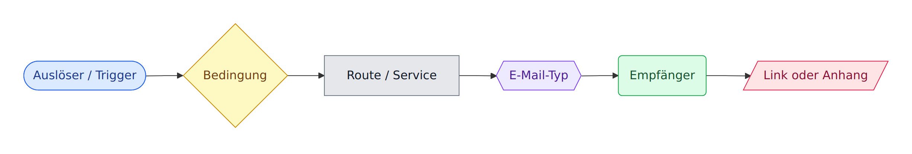

Mermaid-Quellcode anzeigen

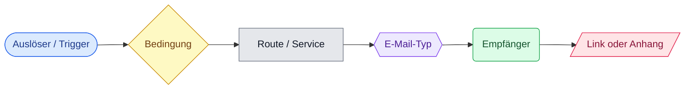
```mermaid
flowchart LR
  T([Auslöser / Trigger]):::trigger
  C{Bedingung}:::cond
  R[Route / Service]:::route
  M{{E-Mail-Typ}}:::mail
  E(Empfänger):::recv
  L[/"Link oder Anhang"/]:::link

  T --> C --> R --> M --> E --> L

  classDef trigger fill:#dbeafe,stroke:#2563eb,color:#1e3a8a;
  classDef cond fill:#fef9c3,stroke:#ca8a04,color:#713f12;
  classDef route fill:#e5e7eb,stroke:#6b7280,color:#111827;
  classDef mail fill:#ede9fe,stroke:#7c3aed,color:#4c1d95;
  classDef recv fill:#dcfce7,stroke:#16a34a,color:#14532d;
  classDef link fill:#ffe4e6,stroke:#e11d48,color:#881337;
```

| Form | Bedeutung |
|---|---|
| Stadion `([…])` | Auslöser (User-Aktion, Admin-Aktion, Scheduler, System-Ereignis) |
| Raute `{…}` | Bedingung / Verzweigung |
| Rechteck `[…]` | Route oder Service, der die E-Mail verschickt |
| Hexagon `{{…}}` | E-Mail-Typ (Template) |
| Abgerundet `(…)` | Empfänger |
| Parallelogramm `[/…/]` | Enthaltene Links bzw. Anhänge |

---

## 1. User-Aktionen

E-Mails, die durch direkte Aktionen normaler Nutzer ausgelöst werden.

Mermaid-Quellcode anzeigen

```mermaid
flowchart TD
  %% Registrierung & Konto
  reg([Registrierung]):::trigger --> authReg[POST /api/v1/auth/register]:::route
  resend([Klick: E-Mail erneut senden]):::trigger --> authResend[POST /api/v1/auth/resend-verification]:::route
  authReg --> mWelcome{{welcome}}:::mail
  authResend --> mWelcome
  mWelcome --> rUser1(Nutzer):::recv
  rUser1 --> lVerify[/"Verifizierungs-Link<br>/email-bestaetigen/TOKEN"/]:::link

  emailChange([E-Mail-Adresse ändern]):::trigger --> authEmail[POST /api/v1/auth/request-email-change]:::route
  authEmail --> mEmailChange{{email_change}}:::mail
  mEmailChange --> rNewEmail(Neue E-Mail-Adresse):::recv
  rNewEmail --> lConfirm[/"Bestätigungs-Link<br>/email-bestaetigen/TOKEN"/]:::link

  forgot([Passwort vergessen]):::trigger --> authReset[POST /api/v1/auth/request-password-reset]:::route
  authReset --> mReset{{password_reset}}:::mail
  mReset --> rUser2(Nutzer):::recv
  rUser2 --> lReset[/"Reset-Link<br>/passwort-zuruecksetzen/TOKEN"/]:::link

  changedPw([Passwort geändert / zurückgesetzt]):::trigger --> authChanged[POST /api/v1/auth/reset-password<br>oder /change-password]:::route
  authChanged --> mChanged{{password_changed}}:::mail
  mChanged --> rUser3(Nutzer):::recv
  rUser3 --> lNone1[/"Keine Links"/]:::link

  %% Umfrage erstellen
  create([Umfrage erstellt]):::trigger --> pollRoute[POST /api/v1/polls<br>oder /api/v1/ai/create-poll]:::route
  pollRoute --> condCreatorEmail{E-Mail-Adresse<br>vorhanden?}:::cond
  condCreatorEmail -->|Nein – anonym,<br>keine E-Mail| skip[/"Keine E-Mail"/]:::link
  condCreatorEmail -->|Ja| mCreated{{poll_created}}:::mail
  mCreated --> rCreator(Ersteller):::recv
  rCreator --> lPublic1[/"Öffentlicher Link<br>/poll/TOKEN"/]:::link
  rCreator --> lAdmin1[/"Admin-Link<br>/admin/TOKEN"/]:::link

  %% Einladung
  invite([Ersteller lädt Teilnehmer ein]):::trigger --> inviteRoute[POST /api/v1/polls/admin/:token/invite]:::route
  inviteRoute --> mInvite{{invitation}}:::mail
  mInvite --> rInvitee(Eingeladene):::recv
  rInvitee --> lPublic2[/"Öffentlicher Link<br>/poll/TOKEN"/]:::link
  rInvitee --> lQR1[/"QR-Code"/]:::link
  rInvitee --> lMsg[/"Optionale persönliche Nachricht"/]:::link

  %% Abstimmen
  vote([Stimme abgegeben]):::trigger --> condEmail{E-Mail<br>angegeben?}:::cond
  condEmail -->|Nein| skip2[/"Keine E-Mail"/]:::link
  condEmail -->|Ja| voteRoute[POST /api/v1/polls/:token/vote<br>oder /vote-bulk]:::route
  resendVote([Klick: Bestätigung erneut senden]):::trigger --> resendRoute[POST /api/v1/polls/:token/resend-email]:::route
  voteRoute --> mConfirm{{vote_confirmation}}:::mail
  resendRoute --> mConfirm
  mConfirm --> rVoter1(Voter):::recv
  rVoter1 --> lPublic3[/"Öffentlicher Link"/]:::link
  rVoter1 --> lResults1[/"Ergebnis-Link<br>/poll/TOKEN#results"/]:::link
  rVoter1 --> lEdit1[/"Bearbeiten-Link<br>/edit/EDIT_TOKEN"/]:::link
  rVoter1 --> lSel1[/"Liste der abgegebenen Stimmen"/]:::link

  editVote([Stimme bearbeitet]):::trigger --> editRoute[PUT /api/v1/votes/edit/:editToken]:::route
  editRoute --> mUpdated{{vote_updated}}:::mail
  mUpdated --> rVoter2(Voter):::recv
  rVoter2 --> lPublic4[/"Öffentlicher Link"/]:::link
  rVoter2 --> lResults2[/"Ergebnis-Link"/]:::link
  rVoter2 --> lEdit2[/"Bearbeiten-Link"/]:::link
  rVoter2 --> lSel2[/"Neue Stimmen-Liste"/]:::link

  %% Erinnerung (manuell)
  remind([Ersteller klickt „Erinnern“]):::trigger --> remindRoute[POST /api/v1/polls/admin/:token/remind]:::route
  remindRoute --> mReminder{{reminder}}:::mail
  mReminder --> rParts1(Vom Ersteller angegebene Adressen):::recv
  rParts1 --> lPublic5[/"Öffentlicher Link"/]:::link
  rParts1 --> lQR2[/"QR-Code"/]:::link
  rParts1 --> lExpiry1[/"Ablaufdatum + optionale Nachricht"/]:::link

  %% Kontolöschung
  delReq([Nutzer beantragt Kontolöschung]):::trigger --> delRoute[POST /api/v1/auth/request-deletion]:::route
  delRoute --> mDelReq{{Löschanfrage-Hinweis}}:::mail
  mDelReq --> rAdmins1(Alle Admins):::recv
  rAdmins1 --> lAdminPanel[/"Admin-Panel-Link<br>/admin?tab=deletion-requests"/]:::link

  classDef trigger fill:#dbeafe,stroke:#2563eb,color:#1e3a8a;
  classDef cond fill:#fef9c3,stroke:#ca8a04,color:#713f12;
  classDef route fill:#e5e7eb,stroke:#6b7280,color:#111827;
  classDef mail fill:#ede9fe,stroke:#7c3aed,color:#4c1d95;
  classDef recv fill:#dcfce7,stroke:#16a34a,color:#14532d;
  classDef link fill:#ffe4e6,stroke:#e11d48,color:#881337;
```

**Wichtig zu den Links:**
- Die **Stimmbestätigung** (`vote_confirmation`) und **Stimm-Aktualisierung** (`vote_updated`) enthalten als einzige einen **Bearbeiten-Link** (`/edit/EDIT_TOKEN`), mit dem der Voter seine Stimme später ändern kann. Die Stimmbestätigung kann auch über „Bestätigung erneut senden" (`/resend-email`) erneut ausgelöst werden.
- Die **Umfrage-erstellt**-E-Mail (`poll_created`) ist die einzige, die den **Admin-Link** (`/admin/TOKEN`) enthält – damit verwaltet der Ersteller seine Umfrage.
- Die **E-Mail-Änderung**-Bestätigung (`email_change`) geht an die **neue** Adresse, damit der Nutzer deren Besitz bestätigt.
- Die **Passwort-geändert**-E-Mail (`password_changed`) enthält **bewusst keinen Link** – sie ist eine reine Sicherheits-Benachrichtigung.
- **`poll_created`** wird auch an **anonyme Ersteller** verschickt – vorausgesetzt, sie geben beim Erstellen eine E-Mail-Adresse an. Gibt ein anonymer Ersteller eine E-Mail-Adresse an, die bereits zu einem registrierten Konto gehört, schlägt die Erstellung mit **409** fehl (Pflicht zur Anmeldung).
- Bei Erstellern **ohne E-Mail-Adresse** (anonym, kein Adress-Feld ausgefüllt) und bei Votern ohne E-Mail wird **keine** E-Mail verschickt.

### Einzelne Flows im Detail

1a · Registrierung &amp; E-Mail-Verifizierung

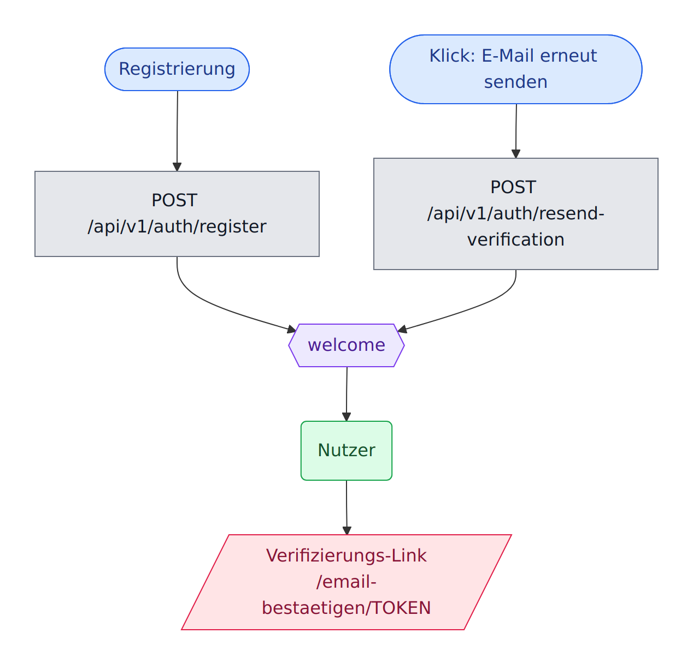

Mermaid-Quellcode anzeigen

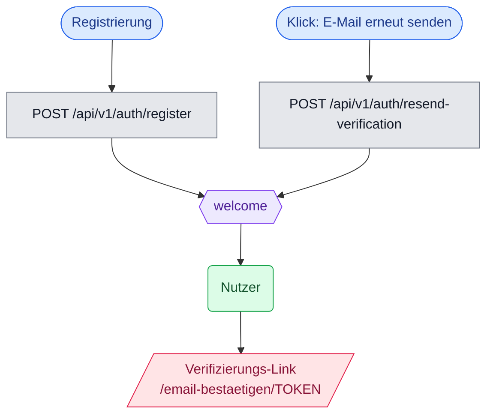
```mermaid
%% render-as: 02a-registrierung-verifizierung
flowchart TD
  reg([Registrierung]):::trigger --> authReg[POST /api/v1/auth/register]:::route
  resend([Klick: E-Mail erneut senden]):::trigger --> authResend[POST /api/v1/auth/resend-verification]:::route
  authReg --> mWelcome{{welcome}}:::mail
  authResend --> mWelcome
  mWelcome --> rUser(Nutzer):::recv
  rUser --> lVerify[/"Verifizierungs-Link<br>/email-bestaetigen/TOKEN"/]:::link

  classDef trigger fill:#dbeafe,stroke:#2563eb,color:#1e3a8a;
  classDef route fill:#e5e7eb,stroke:#6b7280,color:#111827;
  classDef mail fill:#ede9fe,stroke:#7c3aed,color:#4c1d95;
  classDef recv fill:#dcfce7,stroke:#16a34a,color:#14532d;
  classDef link fill:#ffe4e6,stroke:#e11d48,color:#881337;
```

1b · E-Mail-Adresse ändern

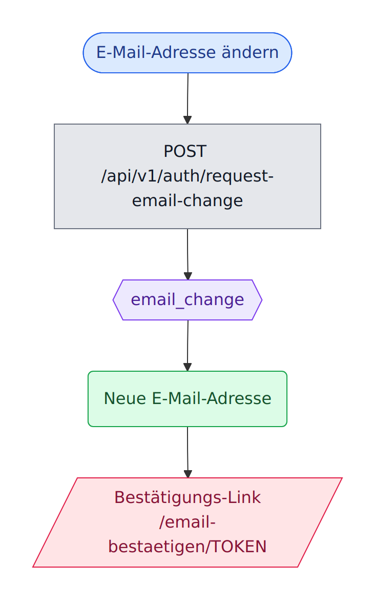

Mermaid-Quellcode anzeigen

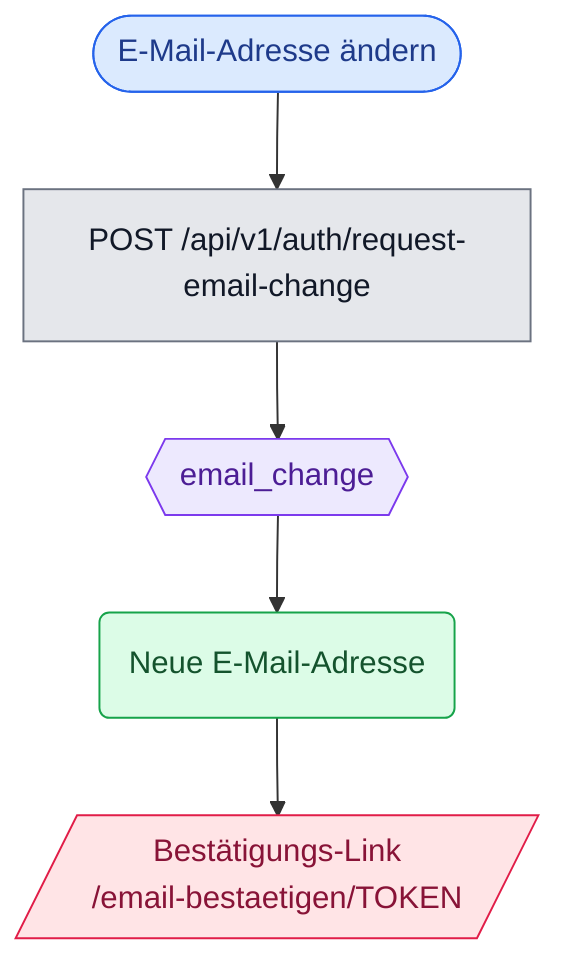
```mermaid
%% render-as: 02b-email-adresse-aendern
flowchart TD
  emailChange([E-Mail-Adresse ändern]):::trigger --> authEmail[POST /api/v1/auth/request-email-change]:::route
  authEmail --> mEmailChange{{email_change}}:::mail
  mEmailChange --> rNewEmail(Neue E-Mail-Adresse):::recv
  rNewEmail --> lConfirm[/"Bestätigungs-Link<br>/email-bestaetigen/TOKEN"/]:::link

  classDef trigger fill:#dbeafe,stroke:#2563eb,color:#1e3a8a;
  classDef route fill:#e5e7eb,stroke:#6b7280,color:#111827;
  classDef mail fill:#ede9fe,stroke:#7c3aed,color:#4c1d95;
  classDef recv fill:#dcfce7,stroke:#16a34a,color:#14532d;
  classDef link fill:#ffe4e6,stroke:#e11d48,color:#881337;
```

1c · Passwort vergessen

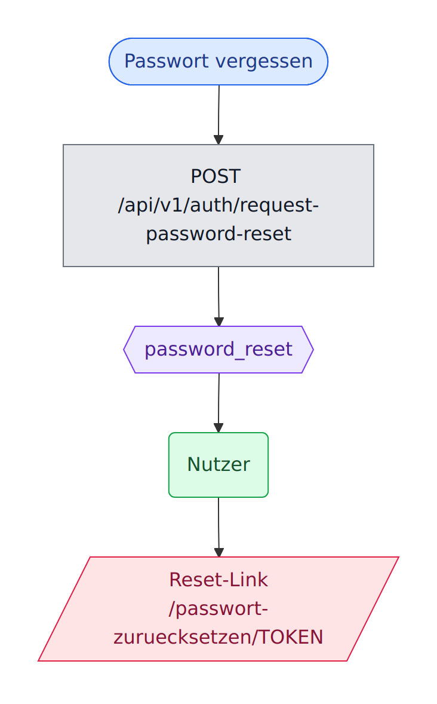

Mermaid-Quellcode anzeigen

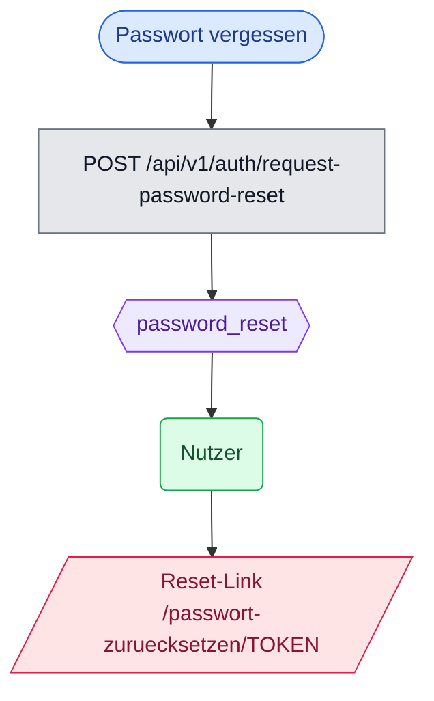
```mermaid
%% render-as: 02c-passwort-vergessen
flowchart TD
  forgot([Passwort vergessen]):::trigger --> authReset[POST /api/v1/auth/request-password-reset]:::route
  authReset --> mReset{{password_reset}}:::mail
  mReset --> rUser(Nutzer):::recv
  rUser --> lReset[/"Reset-Link<br>/passwort-zuruecksetzen/TOKEN"/]:::link

  classDef trigger fill:#dbeafe,stroke:#2563eb,color:#1e3a8a;
  classDef route fill:#e5e7eb,stroke:#6b7280,color:#111827;
  classDef mail fill:#ede9fe,stroke:#7c3aed,color:#4c1d95;
  classDef recv fill:#dcfce7,stroke:#16a34a,color:#14532d;
  classDef link fill:#ffe4e6,stroke:#e11d48,color:#881337;
```

1d · Passwort geändert / zurückgesetzt

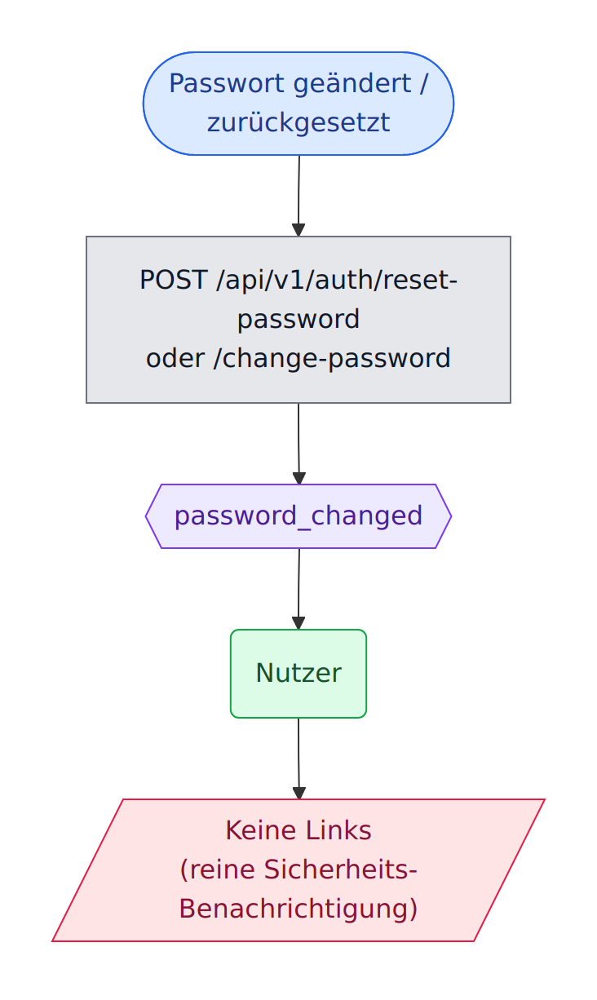

Mermaid-Quellcode anzeigen

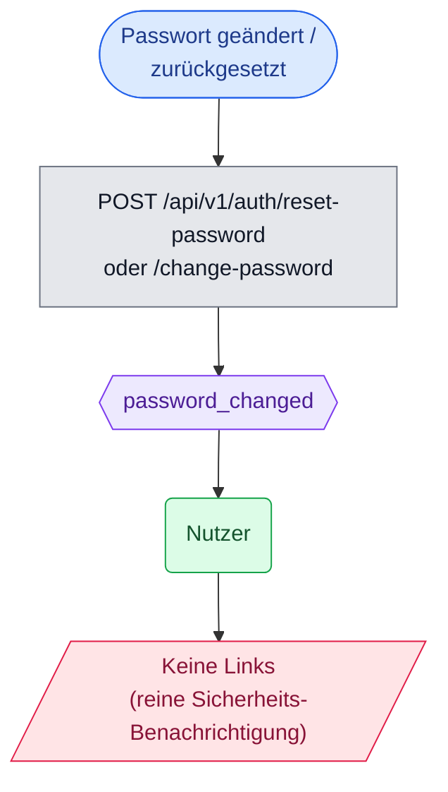
```mermaid
%% render-as: 02d-passwort-geaendert
flowchart TD
  changedPw([Passwort geändert /<br>zurückgesetzt]):::trigger --> authChanged[POST /api/v1/auth/reset-password<br>oder /change-password]:::route
  authChanged --> mChanged{{password_changed}}:::mail
  mChanged --> rUser(Nutzer):::recv
  rUser --> lNone[/"Keine Links<br>(reine Sicherheits-Benachrichtigung)"/]:::link

  classDef trigger fill:#dbeafe,stroke:#2563eb,color:#1e3a8a;
  classDef route fill:#e5e7eb,stroke:#6b7280,color:#111827;
  classDef mail fill:#ede9fe,stroke:#7c3aed,color:#4c1d95;
  classDef recv fill:#dcfce7,stroke:#16a34a,color:#14532d;
  classDef link fill:#ffe4e6,stroke:#e11d48,color:#881337;
```

1e · Umfrage erstellt

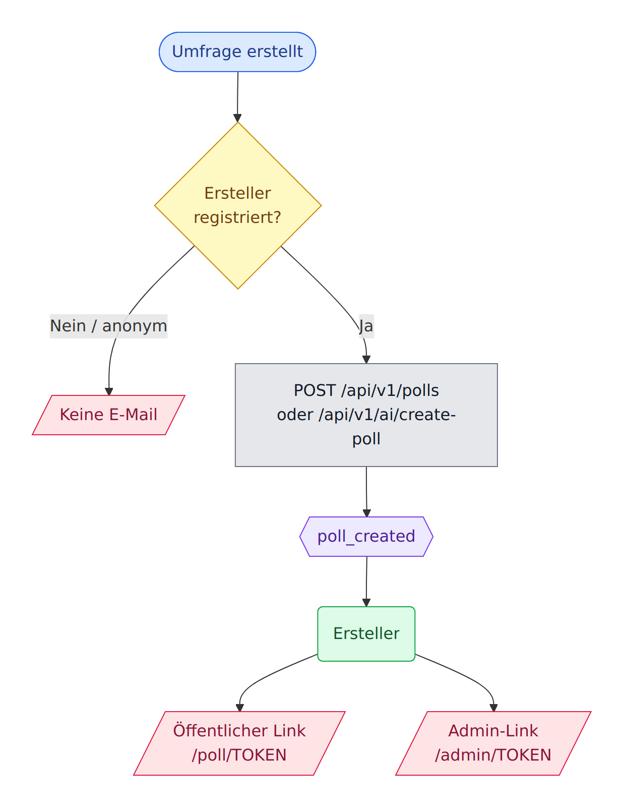

Mermaid-Quellcode anzeigen

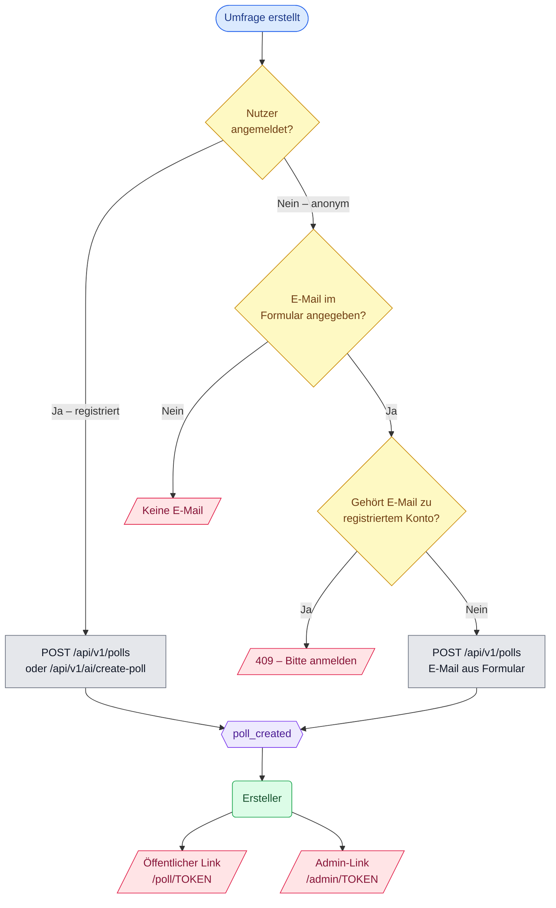
```mermaid
%% render-as: 02e-umfrage-erstellt
flowchart TD
  create([Umfrage erstellt]):::trigger --> condAuth{Nutzer<br>angemeldet?}:::cond
  condAuth -->|Ja – registriert| pollRouteReg[POST /api/v1/polls<br>oder /api/v1/ai/create-poll]:::route
  condAuth -->|Nein – anonym| condFormEmail{E-Mail im<br>Formular angegeben?}:::cond
  condFormEmail -->|Nein| skip[/"Keine E-Mail"/]:::link
  condFormEmail -->|Ja| condKnown{Gehört E-Mail zu<br>registriertem Konto?}:::cond
  condKnown -->|Ja| errLogin[/"409 – Bitte anmelden"/]:::link
  condKnown -->|Nein| pollRouteAnon[POST /api/v1/polls<br>E-Mail aus Formular]:::route
  pollRouteReg --> mCreated{{poll_created}}:::mail
  pollRouteAnon --> mCreated
  mCreated --> rCreator(Ersteller):::recv
  rCreator --> lPublic[/"Öffentlicher Link<br>/poll/TOKEN"/]:::link
  rCreator --> lAdmin[/"Admin-Link<br>/admin/TOKEN"/]:::link

  classDef trigger fill:#dbeafe,stroke:#2563eb,color:#1e3a8a;
  classDef cond fill:#fef9c3,stroke:#ca8a04,color:#713f12;
  classDef route fill:#e5e7eb,stroke:#6b7280,color:#111827;
  classDef mail fill:#ede9fe,stroke:#7c3aed,color:#4c1d95;
  classDef recv fill:#dcfce7,stroke:#16a34a,color:#14532d;
  classDef link fill:#ffe4e6,stroke:#e11d48,color:#881337;
```

1f · Einladung

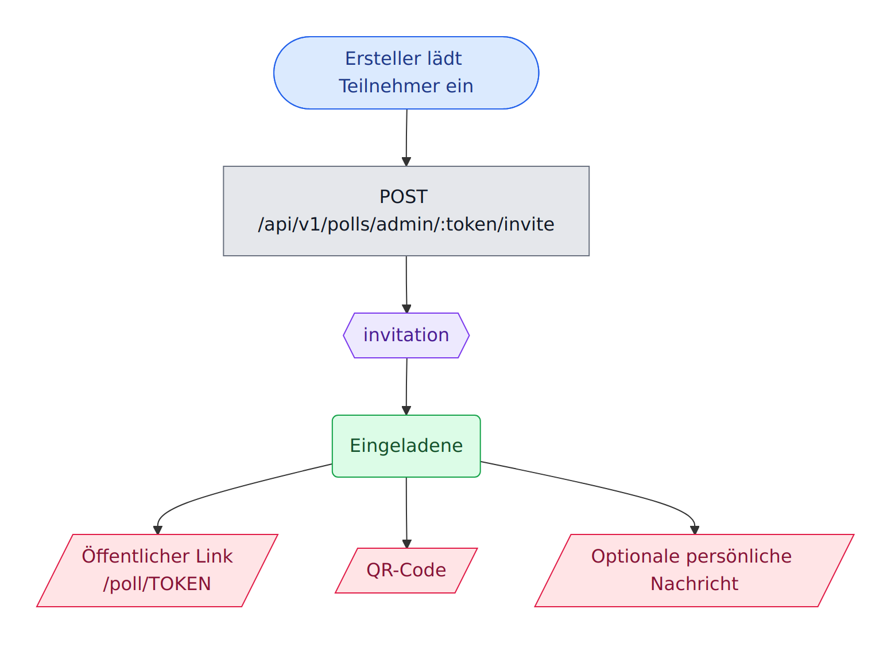

Mermaid-Quellcode anzeigen

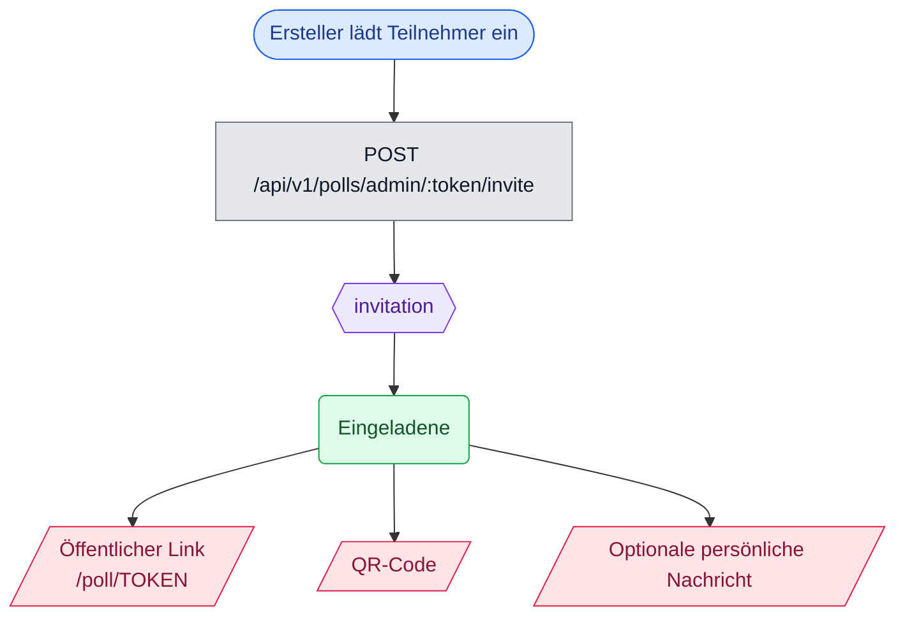
```mermaid
%% render-as: 02f-einladung
flowchart TD
  invite([Ersteller lädt Teilnehmer ein]):::trigger --> inviteRoute[POST /api/v1/polls/admin/:token/invite]:::route
  inviteRoute --> mInvite{{invitation}}:::mail
  mInvite --> rInvitee(Eingeladene):::recv
  rInvitee --> lPublic[/"Öffentlicher Link<br>/poll/TOKEN"/]:::link
  rInvitee --> lQR[/"QR-Code"/]:::link
  rInvitee --> lMsg[/"Optionale persönliche Nachricht"/]:::link

  classDef trigger fill:#dbeafe,stroke:#2563eb,color:#1e3a8a;
  classDef route fill:#e5e7eb,stroke:#6b7280,color:#111827;
  classDef mail fill:#ede9fe,stroke:#7c3aed,color:#4c1d95;
  classDef recv fill:#dcfce7,stroke:#16a34a,color:#14532d;
  classDef link fill:#ffe4e6,stroke:#e11d48,color:#881337;
```

1g · Stimme abgegeben

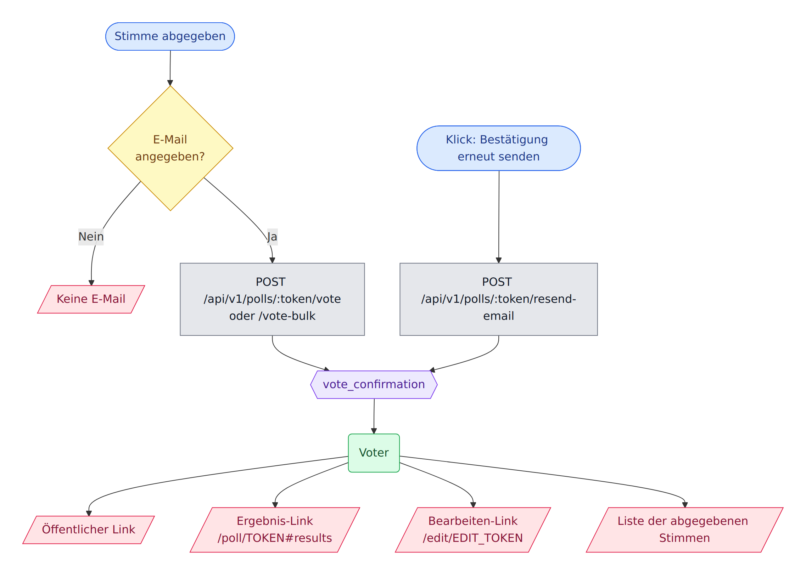

Mermaid-Quellcode anzeigen

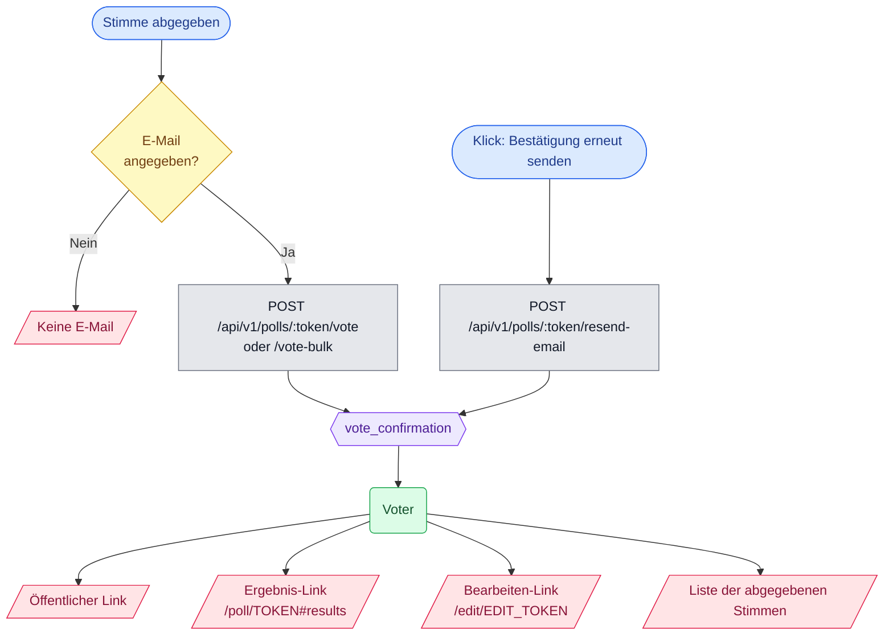
```mermaid
%% render-as: 02g-stimme-abgegeben
flowchart TD
  vote([Stimme abgegeben]):::trigger --> condEmail{E-Mail<br>angegeben?}:::cond
  condEmail -->|Nein| skip[/"Keine E-Mail"/]:::link
  condEmail -->|Ja| voteRoute[POST /api/v1/polls/:token/vote<br>oder /vote-bulk]:::route
  resendVote([Klick: Bestätigung erneut senden]):::trigger --> resendRoute[POST /api/v1/polls/:token/resend-email]:::route
  voteRoute --> mConfirm{{vote_confirmation}}:::mail
  resendRoute --> mConfirm
  mConfirm --> rVoter(Voter):::recv
  rVoter --> lPublic[/"Öffentlicher Link"/]:::link
  rVoter --> lResults[/"Ergebnis-Link<br>/poll/TOKEN#results"/]:::link
  rVoter --> lEdit[/"Bearbeiten-Link<br>/edit/EDIT_TOKEN"/]:::link
  rVoter --> lSel[/"Liste der abgegebenen Stimmen"/]:::link

  classDef trigger fill:#dbeafe,stroke:#2563eb,color:#1e3a8a;
  classDef cond fill:#fef9c3,stroke:#ca8a04,color:#713f12;
  classDef route fill:#e5e7eb,stroke:#6b7280,color:#111827;
  classDef mail fill:#ede9fe,stroke:#7c3aed,color:#4c1d95;
  classDef recv fill:#dcfce7,stroke:#16a34a,color:#14532d;
  classDef link fill:#ffe4e6,stroke:#e11d48,color:#881337;
```

1h · Stimme bearbeitet

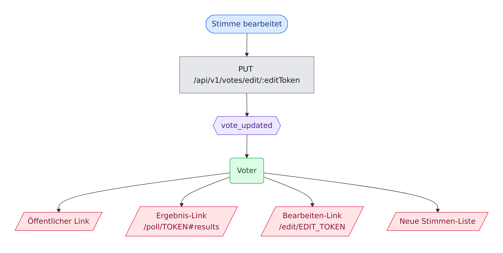

Mermaid-Quellcode anzeigen

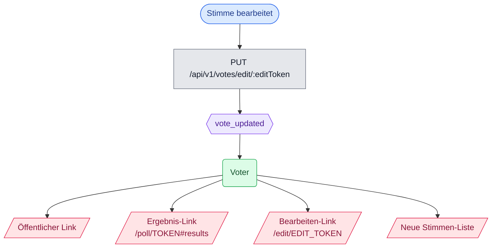
```mermaid
%% render-as: 02h-stimme-bearbeitet
flowchart TD
  editVote([Stimme bearbeitet]):::trigger --> editRoute[PUT /api/v1/votes/edit/:editToken]:::route
  editRoute --> mUpdated{{vote_updated}}:::mail
  mUpdated --> rVoter(Voter):::recv
  rVoter --> lPublic[/"Öffentlicher Link"/]:::link
  rVoter --> lResults[/"Ergebnis-Link<br>/poll/TOKEN#results"/]:::link
  rVoter --> lEdit[/"Bearbeiten-Link<br>/edit/EDIT_TOKEN"/]:::link
  rVoter --> lSel[/"Neue Stimmen-Liste"/]:::link

  classDef trigger fill:#dbeafe,stroke:#2563eb,color:#1e3a8a;
  classDef route fill:#e5e7eb,stroke:#6b7280,color:#111827;
  classDef mail fill:#ede9fe,stroke:#7c3aed,color:#4c1d95;
  classDef recv fill:#dcfce7,stroke:#16a34a,color:#14532d;
  classDef link fill:#ffe4e6,stroke:#e11d48,color:#881337;
```

1i · Erinnerung (manuell)

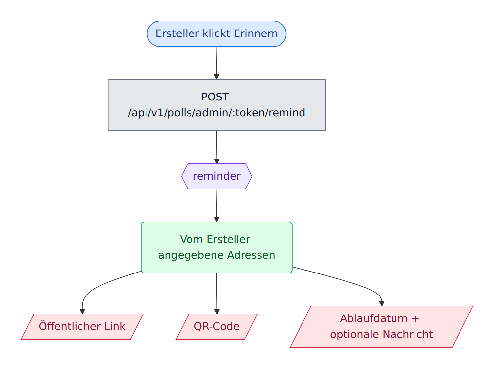

Mermaid-Quellcode anzeigen

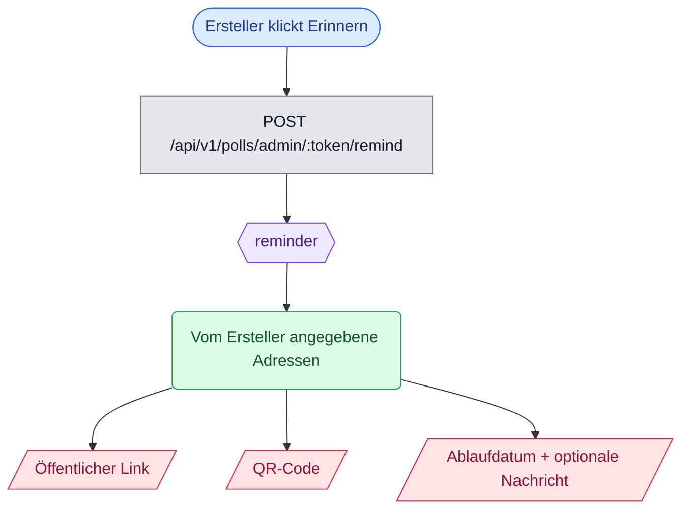
```mermaid
%% render-as: 02i-erinnerung-manuell
flowchart TD
  remind([Ersteller klickt Erinnern]):::trigger --> remindRoute[POST /api/v1/polls/admin/:token/remind]:::route
  remindRoute --> mReminder{{reminder}}:::mail
  mReminder --> rParts(Vom Ersteller angegebene Adressen):::recv
  rParts --> lPublic[/"Öffentlicher Link"/]:::link
  rParts --> lQR[/"QR-Code"/]:::link
  rParts --> lExpiry[/"Ablaufdatum + optionale Nachricht"/]:::link

  classDef trigger fill:#dbeafe,stroke:#2563eb,color:#1e3a8a;
  classDef route fill:#e5e7eb,stroke:#6b7280,color:#111827;
  classDef mail fill:#ede9fe,stroke:#7c3aed,color:#4c1d95;
  classDef recv fill:#dcfce7,stroke:#16a34a,color:#14532d;
  classDef link fill:#ffe4e6,stroke:#e11d48,color:#881337;
```

1j · Kontolöschung beantragen

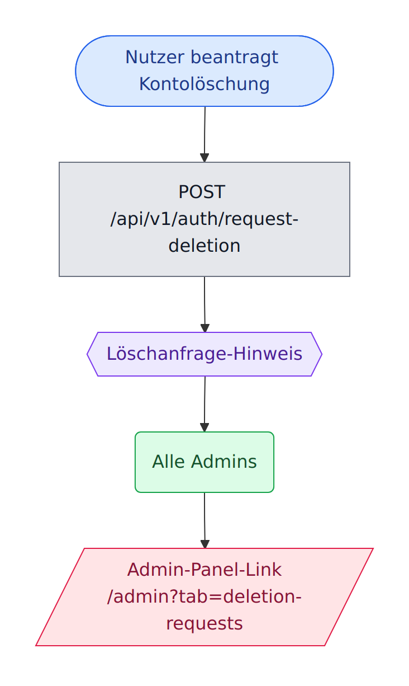

Mermaid-Quellcode anzeigen

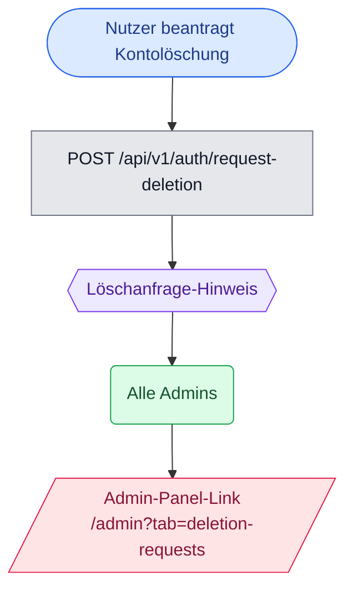
```mermaid
%% render-as: 02j-kontoloesung-beantragen
flowchart TD
  delReq([Nutzer beantragt Kontolöschung]):::trigger --> delRoute[POST /api/v1/auth/request-deletion]:::route
  delRoute --> mDelReq{{Löschanfrage-Hinweis}}:::mail
  mDelReq --> rAdmins(Alle Admins):::recv
  rAdmins --> lAdminPanel[/"Admin-Panel-Link<br>/admin?tab=deletion-requests"/]:::link

  classDef trigger fill:#dbeafe,stroke:#2563eb,color:#1e3a8a;
  classDef route fill:#e5e7eb,stroke:#6b7280,color:#111827;
  classDef mail fill:#ede9fe,stroke:#7c3aed,color:#4c1d95;
  classDef recv fill:#dcfce7,stroke:#16a34a,color:#14532d;
  classDef link fill:#ffe4e6,stroke:#e11d48,color:#881337;
```

---

## 2. Admin-Aktionen

E-Mails, die ein Administrator auslöst.

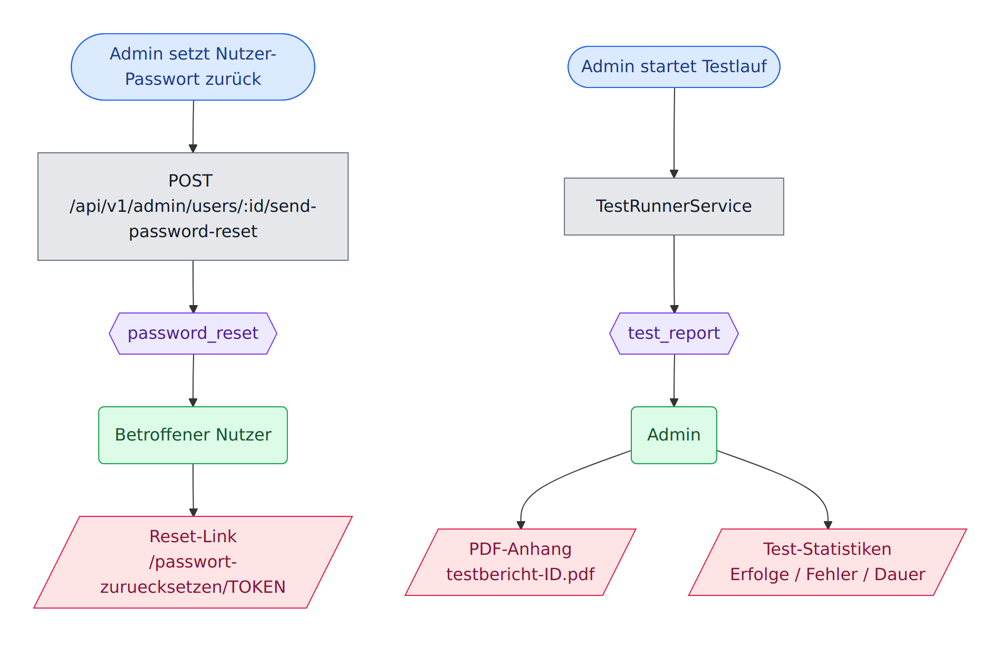

Mermaid-Quellcode anzeigen

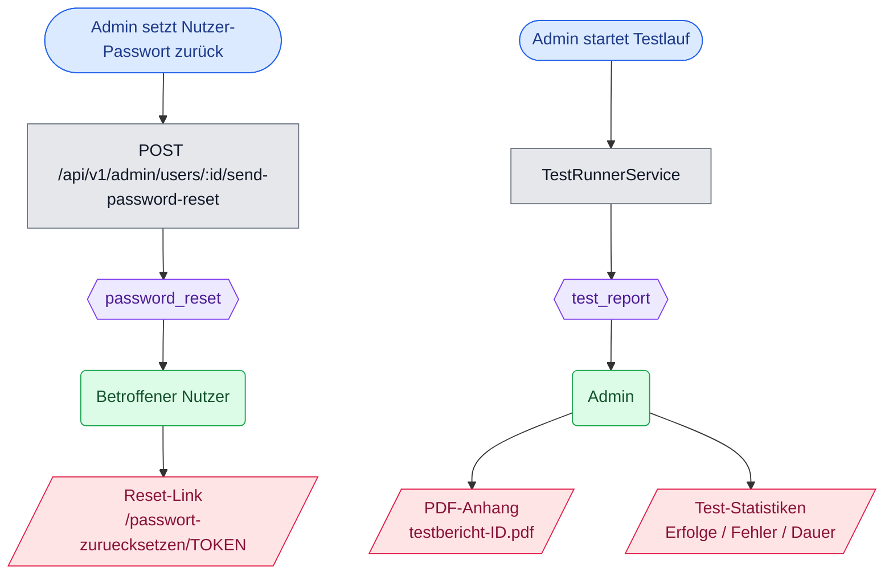
```mermaid
flowchart TD
  adminReset([Admin setzt Nutzer-Passwort zurück]):::trigger --> adminRoute[POST /api/v1/admin/users/:id/send-password-reset]:::route
  adminRoute --> mReset{{password_reset}}:::mail
  mReset --> rUser(Betroffener Nutzer):::recv
  rUser --> lReset[/"Reset-Link<br>/passwort-zuruecksetzen/TOKEN"/]:::link

  testRun([Admin startet Testlauf]):::trigger --> testService[TestRunnerService]:::route
  testService --> mTest{{test_report}}:::mail
  mTest --> rAdmin(Admin):::recv
  rAdmin --> lPdf[/"PDF-Anhang<br>testbericht-ID.pdf"/]:::link
  rAdmin --> lStats[/"Test-Statistiken<br>Erfolge / Fehler / Dauer"/]:::link

  classDef trigger fill:#dbeafe,stroke:#2563eb,color:#1e3a8a;
  classDef route fill:#e5e7eb,stroke:#6b7280,color:#111827;
  classDef mail fill:#ede9fe,stroke:#7c3aed,color:#4c1d95;
  classDef recv fill:#dcfce7,stroke:#16a34a,color:#14532d;
  classDef link fill:#ffe4e6,stroke:#e11d48,color:#881337;
```

**Wichtig:** Der **Test-Bericht** (`test_report`) ist die einzige E-Mail mit einem **PDF-Anhang**. (Der Admin kann ein Passwort über `/set-password` auch direkt setzen – dabei wird **keine** E-Mail versendet.)

---

## 3. Umfrage-Finalisierung (manuell)

Wenn ein Admin eine Umfrage manuell abschließt, hängen die E-Mails vom **Umfrage-Typ** ab. Den automatischen Ablauf über den Scheduler beschreibt Abschnitt 4.

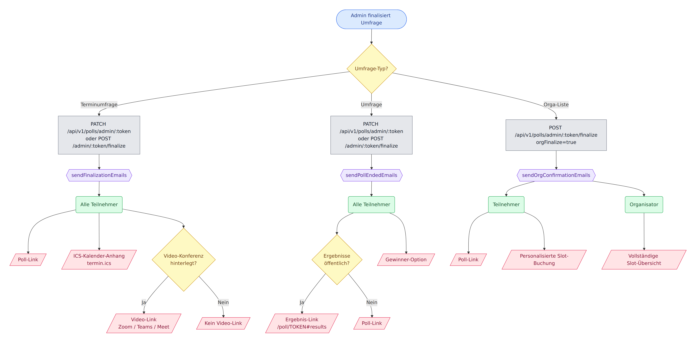

Mermaid-Quellcode anzeigen

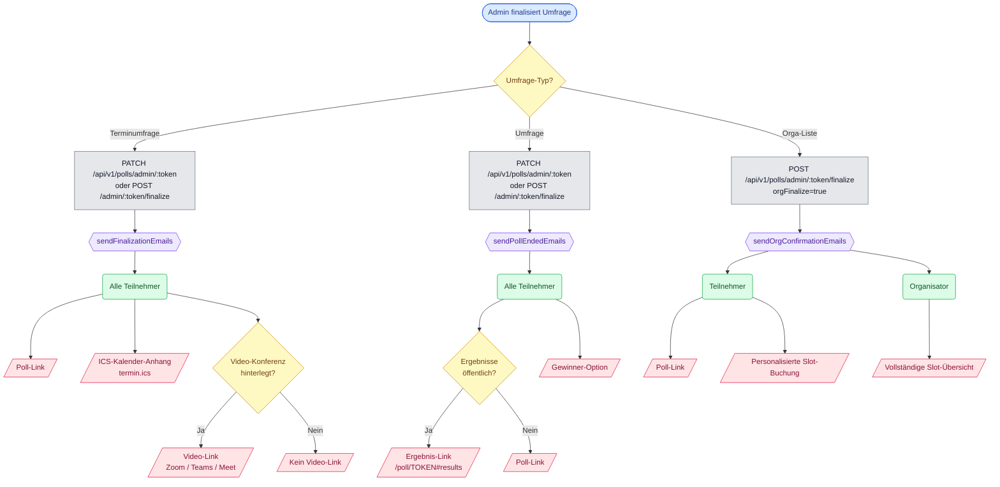
```mermaid
flowchart TD
  final([Admin finalisiert Umfrage]):::trigger --> condType{Umfrage-Typ?}:::cond

  %% Schedule
  condType -->|Terminumfrage| schedRoute[PATCH /api/v1/polls/admin/:token<br>oder POST /admin/:token/finalize]:::route
  schedRoute --> mFinal{{sendFinalizationEmails}}:::mail
  mFinal --> rParts1(Alle Teilnehmer):::recv
  rParts1 --> lPoll1[/"Poll-Link"/]:::link
  rParts1 --> lIcs[/"ICS-Kalender-Anhang<br>termin.ics"/]:::link
  rParts1 --> condVideo{Video-Konferenz<br>hinterlegt?}:::cond
  condVideo -->|Ja| lVideo[/"Video-Link<br>Zoom / Teams / Meet"/]:::link
  condVideo -->|Nein| lNoVideo[/"Kein Video-Link"/]:::link

  %% Survey
  condType -->|Umfrage| surveyRoute[PATCH /api/v1/polls/admin/:token<br>oder POST /admin/:token/finalize]:::route
  surveyRoute --> mEnded1{{sendPollEndedEmails}}:::mail
  mEnded1 --> rParts2(Alle Teilnehmer):::recv
  rParts2 --> condPublic{Ergebnisse<br>öffentlich?}:::cond
  condPublic -->|Ja| lResults[/"Ergebnis-Link<br>/poll/TOKEN#results"/]:::link
  condPublic -->|Nein| lPoll2[/"Poll-Link"/]:::link
  rParts2 --> lWinner[/"Gewinner-Option"/]:::link

  %% Organization
  condType -->|Orga-Liste| orgRoute[POST /api/v1/polls/admin/:token/finalize<br>orgFinalize=true]:::route
  orgRoute --> mOrg{{sendOrgConfirmationEmails}}:::mail
  mOrg --> rPartsOrg(Teilnehmer):::recv
  rPartsOrg --> lPoll3[/"Poll-Link"/]:::link
  rPartsOrg --> lSlotPersonal[/"Personalisierte Slot-Buchung"/]:::link
  mOrg --> rOrganizer(Organisator):::recv
  rOrganizer --> lSlotFull[/"Vollständige Slot-Übersicht"/]:::link

  classDef trigger fill:#dbeafe,stroke:#2563eb,color:#1e3a8a;
  classDef cond fill:#fef9c3,stroke:#ca8a04,color:#713f12;
  classDef route fill:#e5e7eb,stroke:#6b7280,color:#111827;
  classDef mail fill:#ede9fe,stroke:#7c3aed,color:#4c1d95;
  classDef recv fill:#dcfce7,stroke:#16a34a,color:#14532d;
  classDef link fill:#ffe4e6,stroke:#e11d48,color:#881337;
```

**Wichtig zu den Links:**
- Nur die **Terminumfrage-Finalisierung** (`sendFinalizationEmails`) enthält einen **ICS-Kalender-Anhang** (`termin.ics`) und – falls hinterlegt – einen **Video-Konferenz-Link**.
- Bei der **Umfrage** richtet sich der Button-Link danach, ob die Ergebnisse öffentlich sind: Ergebnis-Link (`#results`) oder normaler Poll-Link.
- Bei der **manuellen** Orga-Listen-Finalisierung (`orgFinalize`) wird `sendOrgConfirmationEmails` ausgelöst: **Teilnehmer** bekommen ihre **personalisierte** Slot-Buchung, der **Organisator** eine **vollständige** Übersicht. Läuft eine Orga-Liste hingegen **automatisch** ab, sendet der Scheduler stattdessen `sendPollEndedEmails` (siehe Abschnitt 4).

---

## 4. Automatischer Scheduler

E-Mails, die der `PollSchedulerService` (Prüfung jede Minute) ohne jede Nutzer-Interaktion auslöst.

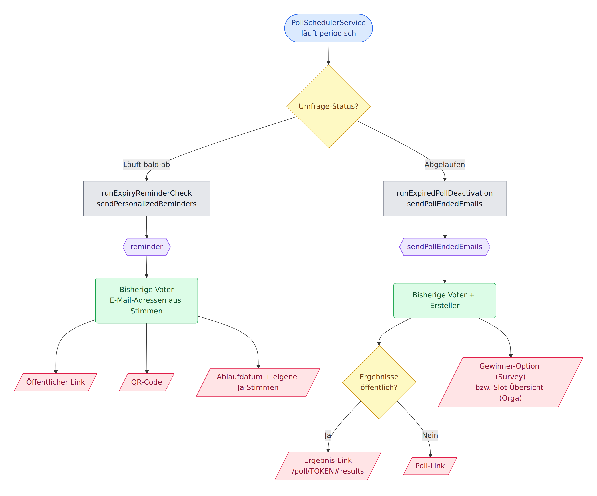

Mermaid-Quellcode anzeigen

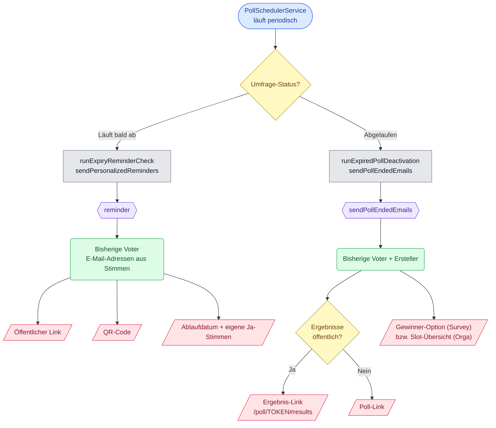
```mermaid
flowchart TD
  scheduler([PollSchedulerService<br>läuft periodisch]):::trigger --> condExpire{Umfrage-Status?}:::cond

  %% Erinnerung vor Ablauf
  condExpire -->|Läuft bald ab| autoRemind[runExpiryReminderCheck<br>sendPersonalizedReminders]:::route
  autoRemind --> mReminder{{reminder}}:::mail
  mReminder --> rVoters(Bisherige Voter<br>E-Mail-Adressen aus Stimmen):::recv
  rVoters --> lPoll[/"Öffentlicher Link"/]:::link
  rVoters --> lQR[/"QR-Code"/]:::link
  rVoters --> lExpiry[/"Ablaufdatum + eigene Ja-Stimmen"/]:::link

  %% Auto-Deaktivierung nach Ablauf
  condExpire -->|Abgelaufen| autoDeact[runExpiredPollDeactivation<br>sendPollEndedEmails]:::route
  autoDeact --> mEnded{{sendPollEndedEmails}}:::mail
  mEnded --> rEndRecv(Bisherige Voter + Ersteller):::recv
  rEndRecv --> condPub2{Ergebnisse<br>öffentlich?}:::cond
  condPub2 -->|Ja| lResults2[/"Ergebnis-Link<br>/poll/TOKEN#results"/]:::link
  condPub2 -->|Nein| lPoll2[/"Poll-Link"/]:::link
  rEndRecv --> lContent[/"Gewinner-Option (Survey)<br>bzw. Slot-Übersicht (Orga)"/]:::link

  classDef trigger fill:#dbeafe,stroke:#2563eb,color:#1e3a8a;
  classDef cond fill:#fef9c3,stroke:#ca8a04,color:#713f12;
  classDef route fill:#e5e7eb,stroke:#6b7280,color:#111827;
  classDef mail fill:#ede9fe,stroke:#7c3aed,color:#4c1d95;
  classDef recv fill:#dcfce7,stroke:#16a34a,color:#14532d;
  classDef link fill:#ffe4e6,stroke:#e11d48,color:#881337;
```

**Wichtig:**
- Die **automatische Erinnerung** (`runExpiryReminderCheck`) geht an die bereits abgestimmten Voter (deren E-Mail-Adressen aus den vorhandenen Stimmen) und zeigt jedem seine eigenen „Ja"-Stimmen.
- Die **automatische Deaktivierung** (`runExpiredPollDeactivation`) sendet beim Ablauf `sendPollEndedEmails` an Voter **und** Ersteller – sowohl für **Umfragen** als auch für **Orga-Listen** (Doppel-Benachrichtigungen werden über das `notification_logs`-Log verhindert). Terminumfragen werden in der Regel manuell finalisiert (Abschnitt 3, mit ICS-Anhang).

---

## 5. Sicherheits-Alert

E-Mail, die das System bei einem erkannten Virus auslöst.

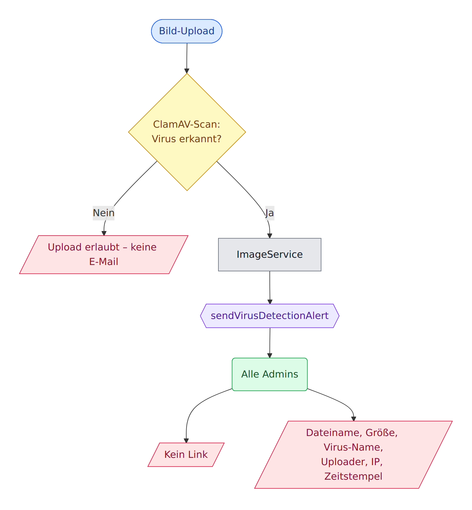

Mermaid-Quellcode anzeigen

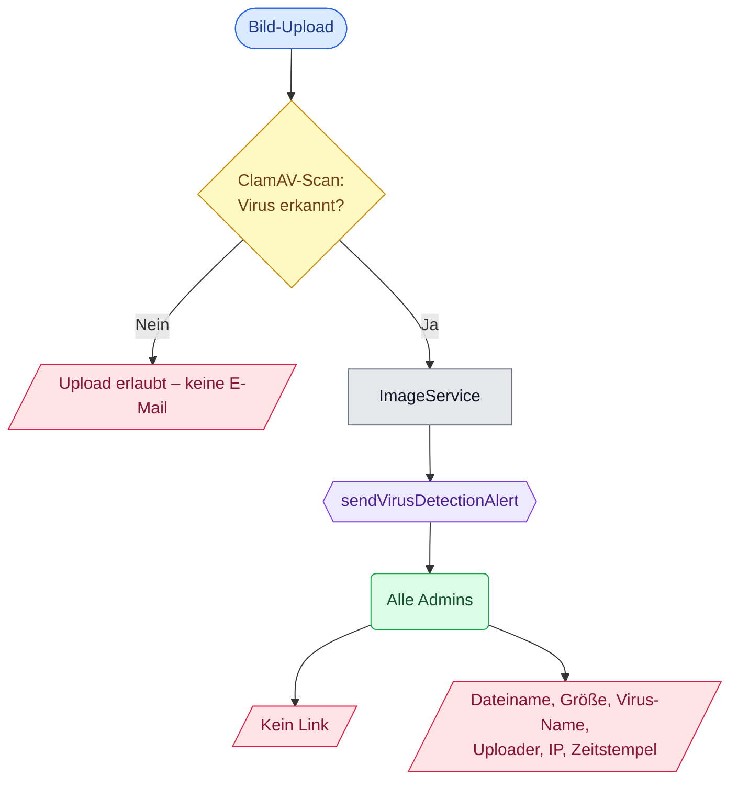
```mermaid
flowchart TD
  upload([Bild-Upload]):::trigger --> clamav{ClamAV-Scan:<br>Virus erkannt?}:::cond
  clamav -->|Nein| ok[/"Upload erlaubt – keine E-Mail"/]:::link
  clamav -->|Ja| imgService[ImageService]:::route
  imgService --> mVirus{{sendVirusDetectionAlert}}:::mail
  mVirus --> rAdmins(Alle Admins):::recv
  rAdmins --> lNoLink[/"Kein Link"/]:::link
  rAdmins --> lMeta[/"Dateiname, Größe, Virus-Name,<br>Uploader, IP, Zeitstempel"/]:::link

  classDef trigger fill:#dbeafe,stroke:#2563eb,color:#1e3a8a;
  classDef cond fill:#fef9c3,stroke:#ca8a04,color:#713f12;
  classDef route fill:#e5e7eb,stroke:#6b7280,color:#111827;
  classDef mail fill:#ede9fe,stroke:#7c3aed,color:#4c1d95;
  classDef recv fill:#dcfce7,stroke:#16a34a,color:#14532d;
  classDef link fill:#ffe4e6,stroke:#e11d48,color:#881337;
```

**Wichtig:** Der Sicherheits-Alert enthält **keinen Link**, sondern nur Metadaten zum blockierten Upload.

---

## Referenztabelle – alle E-Mail-Flows

| # | E-Mail-Typ | Auslöser | Route / Service | Empfänger | Enthaltene Links | Anhänge / Extras |
|---|---|---|---|---|---|---|
| 1 | `poll_created` | Umfrage erstellt (manuell / AI) | `POST /api/v1/polls`, `POST /api/v1/ai/create-poll` | Ersteller (wenn E-Mail vorhanden – registriert oder anonym mit Adresse) | Öffentlicher Link, **Admin-Link** | – |
| 2 | `invitation` | Ersteller lädt Teilnehmer ein | `POST /api/v1/polls/admin/:token/invite` | Eingeladene | Öffentlicher Link, QR-Code | Persönliche Nachricht (optional) |
| 3 | `vote_confirmation` | Stimme abgegeben | `POST /api/v1/polls/:token/vote`, `/vote-bulk` | Voter (nur mit E-Mail) | Öffentlicher Link, Ergebnis-Link, **Bearbeiten-Link** | Liste der Stimmen |
| 4 | `vote_confirmation` | Bestätigung erneut senden | `POST /api/v1/polls/:token/resend-email` | Voter | Öffentlicher Link, Ergebnis-Link, **Bearbeiten-Link** | – |
| 5 | `vote_updated` | Stimme bearbeitet | `PUT /api/v1/votes/edit/:editToken` | Voter | Öffentlicher Link, Ergebnis-Link, **Bearbeiten-Link** | Neue Stimmen-Liste |
| 6 | `reminder` (manuell) | Ersteller klickt „Erinnern" | `POST /api/v1/polls/admin/:token/remind` | Vom Ersteller angegebene Adressen | Öffentlicher Link, QR-Code | Ablaufdatum, optionale Nachricht |
| 7 | `reminder` (automatisch) | Scheduler erkennt baldigen Ablauf | `PollSchedulerService` (`runExpiryReminderCheck`) | Bisherige Voter | Öffentlicher Link, QR-Code | Ablaufdatum, eigene Ja-Stimmen |
| 8 | `password_reset` | Passwort vergessen (User) | `POST /api/v1/auth/request-password-reset` | Nutzer | Reset-Link | – |
| 9 | `password_reset` | Admin sendet Passwort-Reset | `POST /api/v1/admin/users/:id/send-password-reset` | Betroffener Nutzer | Reset-Link | – |
| 10 | `email_change` | E-Mail-Adresse geändert | `POST /api/v1/auth/request-email-change` | Neue E-Mail-Adresse | Bestätigungs-Link | – |
| 11 | `password_changed` | Passwort geändert / zurückgesetzt | `POST /api/v1/auth/reset-password`, `/change-password` | Nutzer | **Keine Links** | – |
| 12 | `welcome` | Registrierung / erneut senden | `POST /api/v1/auth/register`, `/resend-verification` | Nutzer | Verifizierungs-Link | – |
| 13 | `test_report` | Admin-Testlauf abgeschlossen | `TestRunnerService` | Admin | – | **PDF-Anhang** (testbericht-ID.pdf), Test-Statistiken |
| 14 | `poll_finalized` (Schedule) | Terminumfrage manuell finalisiert | `PATCH /api/v1/polls/admin/:token`, `POST /admin/:token/finalize` | Alle Teilnehmer | Poll-Link, Video-Link (optional) | **ICS-Kalender-Anhang** |
| 15 | Poll-beendet (`sendPollEndedEmails`) | Umfrage manuell finalisiert **oder** Umfrage/Orga-Liste läuft automatisch ab | `PATCH /api/v1/polls/admin/:token`, `POST /finalize`, `PollSchedulerService` (`runExpiredPollDeactivation`) | Manuell: alle Teilnehmer · Auto: Voter + Ersteller | Poll-Link **oder** Ergebnis-Link | Gewinner-Option (Survey) / Slot-Übersicht (Orga) |
| 16 | Orga-Bestätigung (`sendOrgConfirmationEmails`) | Orga-Liste manuell finalisiert | `POST /api/v1/polls/admin/:token/finalize` (orgFinalize) | Teilnehmer + Organisator | Poll-Link | Personalisierte / vollständige Slot-Übersicht |
| 17 | Virus-Alert | ClamAV-Alarm bei Upload | `ImageService` | Alle Admins | **Kein Link** | Dateiname, Größe, Virus-Name, IP, Uploader |
| 18 | Löschanfrage-Hinweis | Nutzer beantragt Kontolöschung | `POST /api/v1/auth/request-deletion` | Alle Admins | Admin-Panel-Link | – |

---

## Zusammenfassung der Link-Besonderheiten

- **Admin-Link** (`/admin/TOKEN`): nur in `poll_created`.
- **Bearbeiten-Link** (`/edit/EDIT_TOKEN`): nur in `vote_confirmation` und `vote_updated`.
- **Reset-Link** (`/passwort-zuruecksetzen/TOKEN`): in beiden `password_reset`-Varianten (User & Admin).
- **Verifizierungs-/Bestätigungs-Link** (`/email-bestaetigen/TOKEN`): in `welcome` und `email_change`.
- **QR-Code**: in `invitation` und `reminder`.
- **PDF-Anhang**: nur in `test_report`.
- **ICS-Kalender-Anhang**: nur in der Termin-Finalisierung (`poll_finalized`).
- **Ohne jeden Link**: `password_changed` (Sicherheitshinweis) und der Virus-Alert (nur Metadaten).
